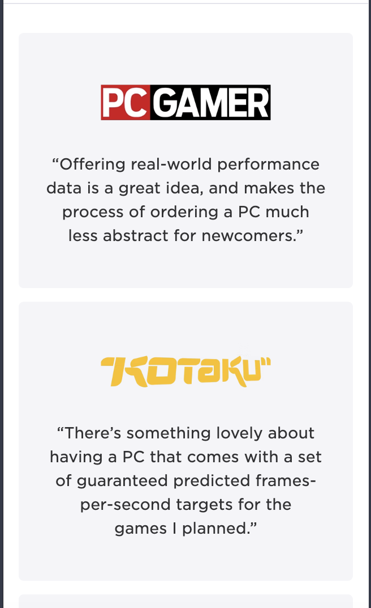
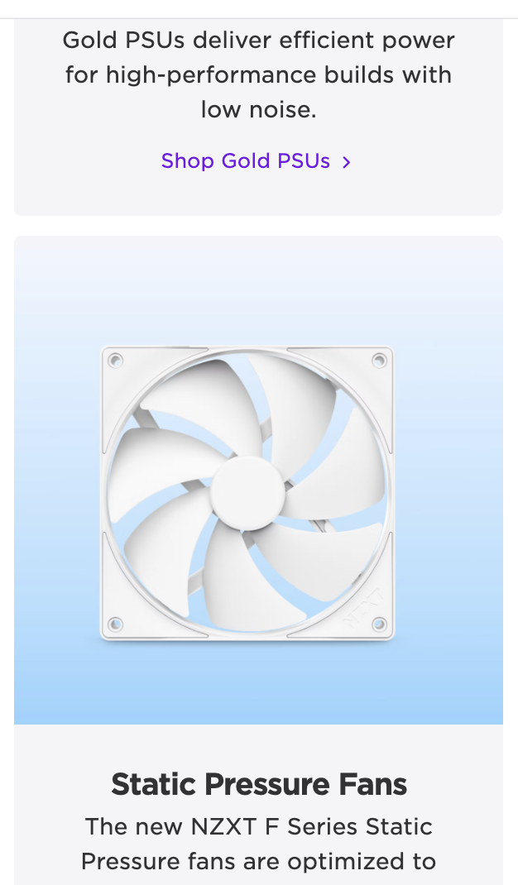
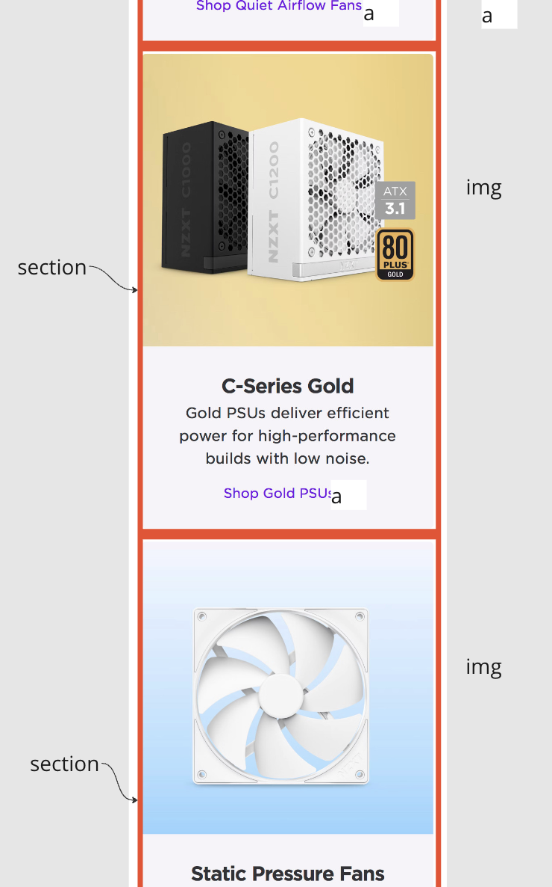
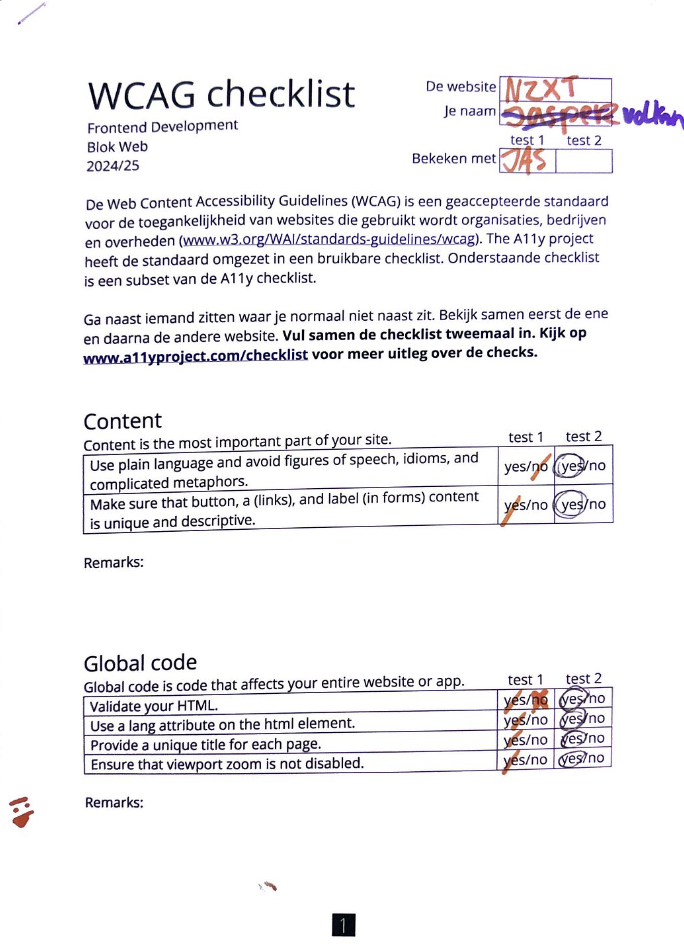
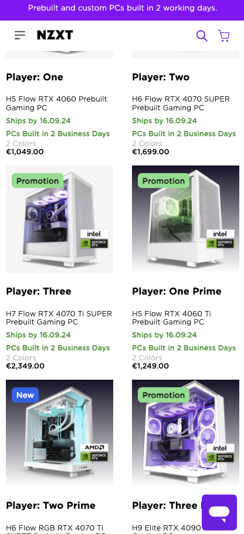

# Procesverslag
Markdown is een simpele manier om HTML te schrijven.  
Markdown cheat cheet: [Hulp bij het schrijven van Markdown](https://github.com/adam-p/markdown-here/wiki/Markdown-Cheatsheet).

Nb. De standaardstructuur en de spartaanse opmaak van de README.md zijn helemaal prima. Het gaat om de inhoud van je procesverslag. Besteedt de tijd voor pracht en praal aan je website.

Nb. Door *open* toe te voegen aan een *details* element kun je deze standaard open zetten. Fijn om dat steeds voor de relevante stuk(ken) te doen.

## Jij

  
uitwerken voor kick-off werkgroep

  ### Auteur:
  Volkan Kocak

  #### Je startniveau:
  Blauw (kies uit zwart, rood óf blauw)

  #### Je focus:
  surface plane (kies uit responsive óf surface plane)
 

## Je website

  
uitwerken voor kick-off werkgroep

  ### Je opdracht:
  https://nzxt.com/ 

  #### Screenshot(s) van de eerste pagina (small screen): 
  Home scherm  
  
  
  
  
  
  
  
  
  
  
  
  
  
  
  

  #### Screenshot(s) van de tweede pagina (small screen):
  Support  
  
  
  
  
 

## Toegankelijkheidstest 1/2 (week 1)

  
uitwerken na test in 2e werkgroep

  ### Bevindingen
  Lijst met je bevindingen die in de test naar voren kwamen:
  ,Als ik gebruik maak van de voice over merk ik al een aantal dingen
  ,De prijzen van de pre-built pc worden overgeslagen en dus niet genoemnd
  ,af en toe is het onduidelijk waar ik mij op het moment bevind
  ,sommige afbeeldingen herkent hij niet
  
  
  
  
  
  

## Breakdownschets (week 1)

  
uitwerken na afloop 3e werkgroep

  ### de hele pagina: 
  

  ### dynamisch deel (bijv menu): 
  

  ### wellicht nog een dynamisch deel (bijv filter): 
  
  
  
  
  
  
  
  
  
  
  
  
  
  

## Voortgang 1 (week 2)

  
uitwerken voor 1e voortgang

  ### Stand van zaken
  hier dit ging goed & dit was lastig (neem ook screenshots op van delen van je website en code)

- het was lastig om de fonts er succesvol in te krijgen, uiteindelijk is het me gelukt met hulp. het duurde wel even want het moest op een andere manier dan dat
ik gewend was.

  ### Agenda voor meeting
  samen met je groepje opstellen

  | student 1      | student 2          | student 3    | student 4        |
  | volkan         | ---                | ---          | ---              |
  | Hoe zet ik 2   | en dit             | en ik dit    | en dan ik dat    |
  | producten met  | dit als er tijd is | nog een punt | dit wil ik zeker |
  | grids naast elkaar | ...                | ...          | ...              |

  ### Verslag van meeting
  hier na afloop snel de uitkomsten van de meeting vastleggen

  - punt 1 - Gebruik articles binnen de sections voor de producten
  - punt 2 - zet de primary kleur in je root
  - punt 3 - gebruik voor het product een form met fieldsets met opties
  - punt 4 - flexbox is niet nodig voor je producten, gebruik articles in je sections, je articles zijn dan grids
  - punt 5 - gebruik voor quote's het element blockquote
  - punt 6 h2 en p kunnen in de section

## Voortgang 2 (week 3)

  
uitwerken voor 2e voortgang

  ### Stand van zaken
  hier dit ging goed & dit was lastig (neem ook screenshots op van delen van je website en code)

dit gedeelte gaat erg moeilijk

  ### Agenda voor meeting
  samen met je groepje opstellen

  | student 1      | student 2          | student 3    | student 4        |
  | Volkan         | ---                | ---          | ---              |
  | hoe zrog ik     | en dit             | en ik dit    | en dan ik dat    |
  | ervoor dat mijn  | dit als er tijd is | nog een punt | dit wil ik zeker |
  | articles op hun plek blijven               | ...                | ...          | ...              |

  ### Verslag van meeting
  hier na afloop snel de uitkomsten van de meeting vastleggen

  - omdat ze in een ul met li zitten, zorgt het ervoor dat ze niet mooi in het midden zitten
  - html ziet er erg goed uit, veel verschillende banners dus classes zijn niet te ontlopen
  - vergeet geen alt teksten neer te zetten bij je afbeeldingen
- voor zover gaat het goed

## Toegankelijkheidstest 2/2 (week 4)

  
uitwerken na test in 9e werkgroep

  
   
    
     
      
  

  ### Bevindingen
  Lijst met je bevindingen die in de test naar voren kwamen (geef ook aan wat er verbeterd is):
- het valt mij op dat er niet heel veel verschillen zijn, wel merkte ik dat ik een video erin heb staan en daar dus wel iets
van toepassing op mij was.
- er is weinig verschil, de echte site doet het ene beter, en mijn site weer het andere

## Voortgang 3 (week 4)

  
uitwerken voor 3e voortgang

  ### Stand van zaken
  hier dit ging goed & dit was lastig (neem ook screenshots op van delen van je website en code)

  ### Agenda voor meeting
  samen met je groepje opstellen

  | student 1      | student 2          | student 3    | student 4        |
  | Volkan           | ---                | ---          | ---              |
  | hoe zit het met divs  | en dit             | en ik dit    | en dan ik dat    |
  | en classes want voor mij | dit als er tijd is | nog een punt | dit wil ik zeker |
  | is het onvermijdelijk            | ...                | ...          | ...              |

  ### Verslag van meeting
  hier na afloop snel de uitkomsten van de meeting vastleggen

  - mijn html ziet er goed en semantisch uit
  - vergeet de alt tekstjes niet
  - het gaat prima ga zo door
  - maak custom properties van je kleuren

## Eindgesprek (week 5)

  
uitwerken voor eindgesprek

  ### Je uitkomst - karakteristiek screenshots:
  
- alhoewel ik coderen erg moeilijk vind is het mij toch gelukt om de website exact na te maken, waarschijnlijk is mijn
code verre van perfect, visueel is het mij wel gelukt

  ### Dit ging goed/Heb ik geleerd: 
  Korte omschrijving met plaatjes

  
 -De gehele site lijkt er zowat exact op en daar ben ik erg torts op, vooral op de producten gedeelte.

  ### Dit was lastig/Is niet gelukt:
  Korte omschrijving met plaatjes

  
  - ik wilde ook een specificatie pagina maken, maar die was te groot en te moeilijk voor mij :/

## Bronnenlijst

  
continu bijhouden terwijl je werkt

  Nb. Wees specifiek ('css-tricks' als bron is bijv. niet specifiek genoeg). 
  Nb. ChatGpT en andere AI horen er ook bij.
  Nb. Vermeld de bronnen ook in je code.

  1. https://lukelowrey.com/css-variable-theme-switcher/
  2. https://www.w3schools.com/
  3. https://codepen.io/
  4. https://developer.mozilla.org/
  5. https://chatgpt.com

